# 前后分离项目记录

## 1.建立数据库表

```mysql
create table ums_user(
id bigint primary key auto_increment,
name varchar (20) not null comment '用户姓名',
phone varchar(11) not null comment '手机号',
email varchar(64) not null comment '用户邮箱',
icon varchar(255) not null comment '用户头像',
active tinyint default 1 not null comment '状态'
)engine=innodb comment '用户表';
```

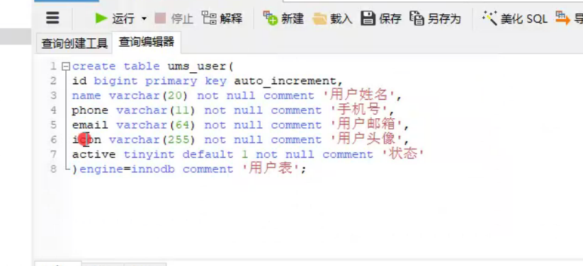


## 2.vue脚手架

```xml
1.安装 node 和 git ，node需要安装长期维护班

2.win + r cmd 回车

3.查看npm的版本号 （npm 是前端的项目构建工，类型java中的maven）
#npm-v

4.如果不是6版本，尽量降级到6版本

5.安装cnpm
#npm install -g cnpm

6.安装vue脚手架 cnpm
#cnpm install -g @vue/cli@3.10.0

7.安装后校验
#vue-V

--------------------------------以上步骤每台电脑只安装一次------------------------------

1.将目录切入到要创建的目录中

2.创建项目 # vue create xxx   xxx是自己的项目名
? Please pick a preset: 选择预设
default (babel, eslint) 默认值
Manually select features 手动选择功能 --选这个 

3. 选择以下四个
? Please pick a preset: Manually select features
? Check the features needed for your project: (Press <space> to select, <a> to toggle all, <i> to invert selection)
(*) Babel
( ) TypeScript
( ) Progressive Web App (PWA) Support
(*) Router
(*) Vuex 
(*) CSS Pre-processors
( ) Linter / Formatter  ---这个千万别选 否则会有格式检查
( ) Unit Testing
( ) E2E Testing

4. 选择 y
? Please pick a preset: Manually select features
? Check the features needed for your project: Babel, Router, Vuex, CSS Pre-processors 
? Use history mode for router? (Requires proper server setup for index fallback in production) (Y/n) 直接回车

5. Less  ----选这个
Sass/SCSS (with dart-sass)
Sass/SCSS (with node-sass)
Less  ----选这个
Stylus

6. 这两个选哪个都行直接回车
? Where do you prefer placing config for Babel, PostCSS, ESLint, etc.? (Use arrow keys)
In dedicated config files
In package.json

7. 直接回车
? Save this as a preset for future projects? (y/N)

8. 有的话选择npm

9.切入到项目目录
#cd 项目名

10.添加axios
#vue add axios

11.添加element ui
#vue add element

12.是否全部引入
? How do you want to import Element? (Use arrow keys)
> Fully import ----图省事选这个
  Import on demand

13.是否添加css预编译
? Do you wish to overwrite Element's SCSS variables? (y/N) 直接回车 是N 上面已经引入过了

```

## 3.搭建后端微服务架构

（父子项目 都是maven项目）

### 3.1父项目(parent)

左边是cloud版本，右边是boot版本 --- 2.2，2.3  ==springboot官网==

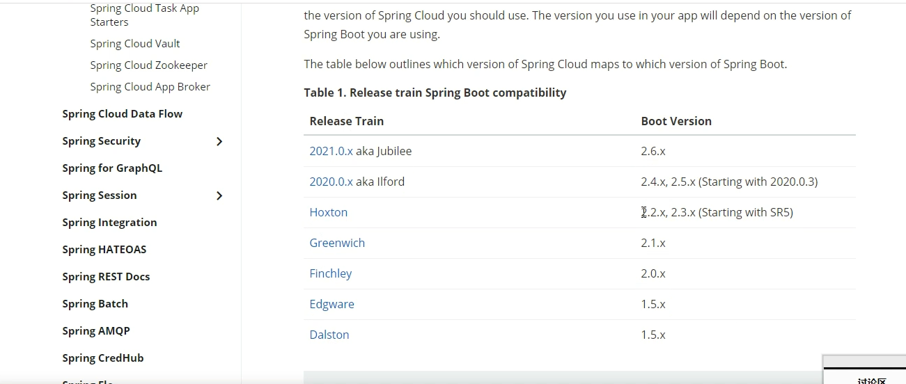

==导入阿里巴巴cloud==

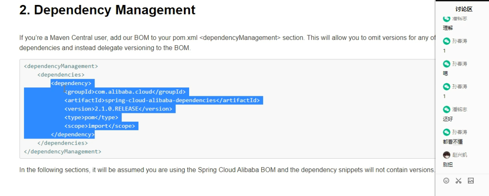

### 3.2父项目的pom文件

```xml
<packaging>pom</packaging> 打包方式是pom 

    <properties>
        <spring-boot.version>2.6.6</spring-boot.version> 1  1和2要看上面的图对应版本
        <spring-cloud.version>2021.0.1</spring-cloud.version> 2 
        <spring-cloud-alibaba.version>2021.0.1.0</spring-cloud-alibaba.version> 
    </properties>

    <dependencyManagement>
        <dependencies>
            <dependency>
                <groupId>org.springframework.boot</groupId>
                <artifactId>spring-boot-dependencies</artifactId>
                <version>${spring-boot.version}</version>
                <type>pom</type>
                <scope>import</scope>
            </dependency>

            <dependency>
                <groupId>org.springframework.cloud</groupId>
                <artifactId>spring-cloud-dependencies</artifactId>
                <version>${spring-cloud.version}</version>
                <type>pom</type>
                <scope>import</scope>
            </dependency>

            <dependency>
                <groupId>com.alibaba.cloud</groupId>
                <artifactId>spring-cloud-alibaba-dependencies</artifactId>
                <version>${spring-cloud-alibaba.version}</version>
                <type>pom</type>
                <scope>import</scope>
            </dependency>

        </dependencies>
    </dependencyManagement>
```

## 4.子项目创建

### 4.1 admin项目创建

* pom导入web依赖 版本号不用写，因为在父项目中已经进行了项目
* 自己手写写启动类和resource里的东西
* 如果想用undertow 可以在web包里exclusion掉tomcat 

```xml
pom依赖

<dependencies>
    <dependency>
        <groupId>org.springframework.boot</groupId>
        <artifactId>spring-boot-starter-web</artifactId>
    </dependency>
</dependencies>
```

### 4.2 product项目创建


```xml
pom依赖

<dependencies>
    <dependency>
        <groupId>org.springframework.boot</groupId>
        <artifactId>spring-boot-starter-web</artifactId>
    </dependency>
</dependencies>
```

### 4.3 entity实体类 

```xml
lomok依赖
mybatis-plus-annotation 注解依赖
```


* 给实体类的父类添加id自增注解 --- 这个需要mybatis-plus-annotation 注解依赖


* 数据库连接池配置


### 4.4 mq代码生成器

```xml
mysql
generator
mybatis-plus
```

```java
/**
 * @Description TODO
 * @Date 2022/4/14 23:46
 * @Version 1.0
 */
public class Generator {
    public static void main(String[] args) {
        //拿到项目路径
        String parent = System.getProperty("user.dir");
        //定义entity路径
        String entityPath = parent + "/entity/src/main/java/com/powernode/entity";
        //其他项目路径
        String otherPath = "/admin";
        //定义表名
        String tableName = "ums_user";

        ///创建生成器对象
        AutoGenerator ag = new AutoGenerator();

        //生成配置开始
        /**
         * 定义全局配置
         */
        GlobalConfig gc = new GlobalConfig();
        gc.setOpen(false);//生成后这是否打开文件
        gc.setAuthor("lxl");//设置生成代码的作者
        gc.setOutputDir(parent);
        gc.setServiceName("%sService");
        ag.setGlobalConfig(gc);

        /**
         * 定义数据源配置
         */
        DataSourceConfig dsc = new DataSourceConfig();
        dsc.setDriverName("com.mysql.jdbc.Driver");
        dsc.setUrl("jdbc:mysql://192.168.175.131:3306/test?useUnicode=true&characterEncoding=utf8");
        dsc.setUsername("root");
        dsc.setPassword("root");
        ag.setDataSource(dsc);

        /**
         * 包配置
         */

        PackageConfig pc = new PackageConfig();
        pc.setParent("com.powernode");

        /**
         * 自定义生成路径
         */
        Map<String,String> map = new HashMap<String, String>();
        map.put("entity_path",entityPath);
        map.put("mapper_path",parent + otherPath + "/src/main/java/com/powernode/mapper");
        map.put("xml_path",parent + otherPath + "/src/main/resources/com/powernode/mapper");
        map.put("service_path",parent + otherPath + "/src/main/java/com/powernode/service");
        map.put("service_impl_path",parent + otherPath + "/src/main/java/com/powernode/service/impl");
        map.put("controller_path",parent + otherPath + "/src/main/java/com/powernode/controller");

        pc.setPathInfo(map);
        ag.setPackageInfo(pc);

        /**
         * 策略配置
         */
        StrategyConfig sc = new StrategyConfig();
        sc.setNaming(NamingStrategy.underline_to_camel);//表名转驼峰
        sc.setColumnNaming(NamingStrategy.underline_to_camel);//字段名转驼峰
        sc.setSuperEntityClass(BaseEntity.class);//设置entity的父类
        sc.setSuperEntityColumns("id");//设置不生成字段
        sc.setEntityLombokModel(true);//设置所有的entity都加data注解
        sc.setRestControllerStyle(true);//设置controller都加RestController注解
        sc.setInclude(tableName);//设置生成的表名
        //sc.setControllerMappingHyphenStyle(true);//设置controller父目录
        ag.setStrategy(sc);

        ag.setTemplateEngine(new FreemarkerTemplateEngine());//设置生成模板引擎
        //生成配置结束

        //代码生成
        ag.execute();
    }
}
```


## 5.注册中心

* 安装注册中心及配置中心（nacos）
* 采用docker容器运行

```xml
docker 命令
MODE=standalone 是配置单机版，集群和单机的写代码都一样

docker run --name lxl-nacos -d -p 8848:8848 -e MODE=standalone nacos/nacos-server:2.0.2
```


## 6.vue + elementui

* 组件 + 模块

```xml

```

## 7.跨域过滤器

```java
在一个模块写即可
@Configuration
public class AdminConfig {

    @Bean
    CorsFilter getCorsFilter(){
        UrlBasedCorsConfigurationSource source = new UrlBasedCorsConfigurationSource();

        CorsConfiguration configuration = new CorsConfiguration();
        configuration.addAllowedOrigin("http://127.0.0.1");
        configuration.addAllowedHeader("*");
        configuration.addAllowedMethod("*");

        source.registerCorsConfiguration("/**",configuration);
        
        return new CorsFilter(source);
    }
}
```


## 10.设置虚拟机的ip

```xml

vi /etc/sysconfig/network-scripts/ifcfg-ens32

按下i进入编辑模式 
第二行dhcp是动态分配ip ---> 改为 static
最后一行ONBOOT 表示网络是否随服务器重启 ----> 选为yes
在最下面添加IPADDR
==========================================
IPADDR=192.168.175.131 ---->这是自定义的固定ip
NETMASK=255.255.255.0 ----> 这是子网掩码
GATEWAY=192.167.175.2 ----> 这可能是子网ip
==========================================
esc :wq

重启网络
systemctl restart network

查看网络配置
ifconfig
```


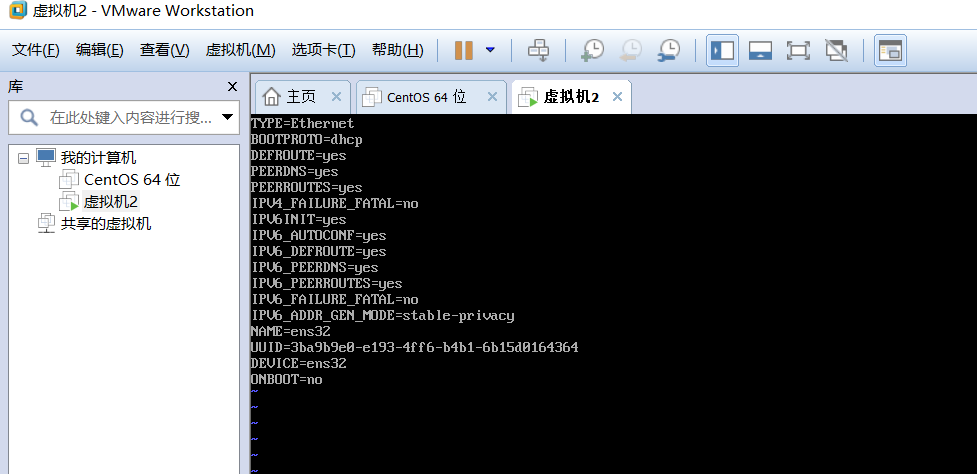

* 看清网段是175

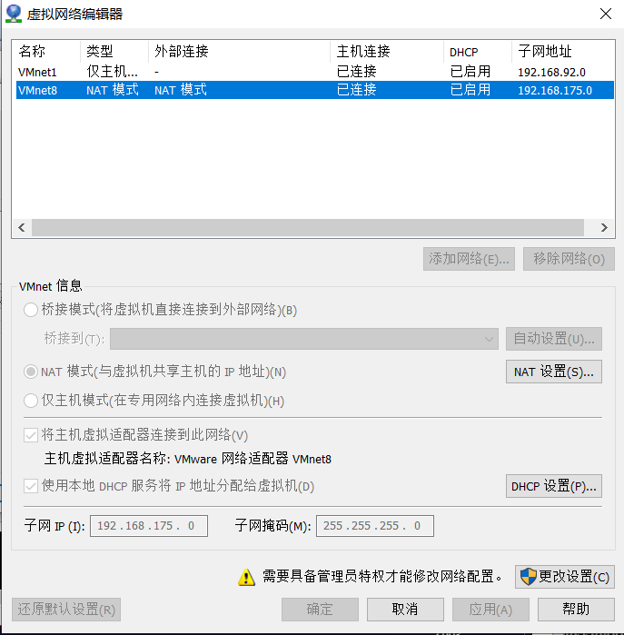

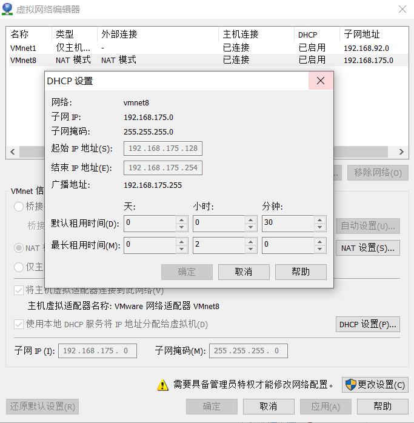

* 端口映射

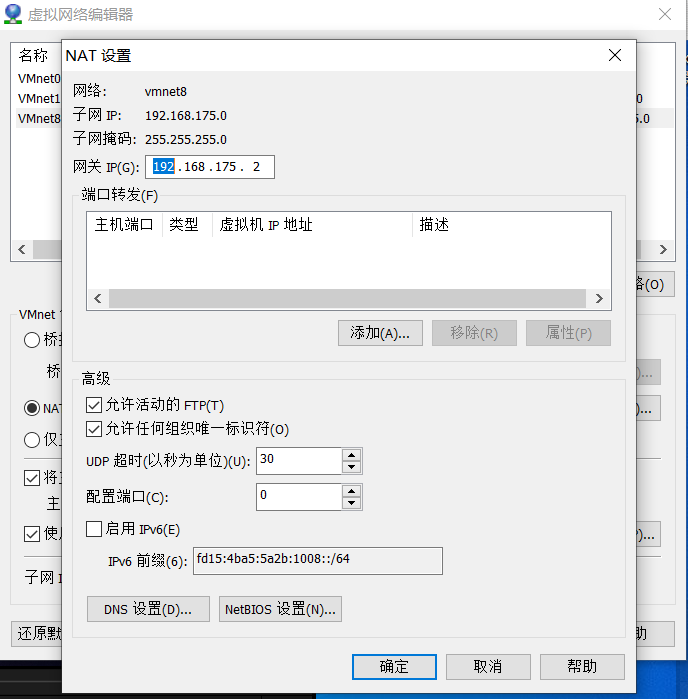

* ipconfig 查询配置的ip是否生效

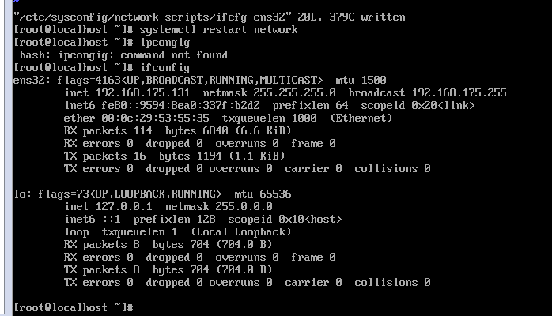

## 11.设置虚拟机的DNS服务器

```xml
vi /etc/resolv.conf

编辑
nameserver 223.5.5.5  这是阿里的dns

保存并退出

测试
ping www.baidu.com

以后就可以用xshell了
```

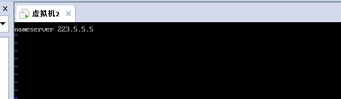

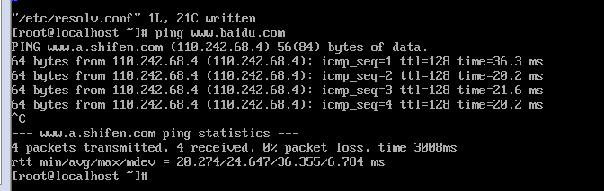

## 12.虚拟机的使用技巧

```xml
date查看服务器时间是否准确

下载时间同步工具
yum -y install ntpdate

执行命令
ntpdate time.windows.com
```

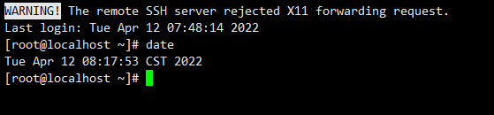

## 13.docker的安装

```xml
1.打开阿里云的容器镜像服务下的镜像加速器

2.按照文档安装 - 安装命令
curl -fsSL https://get.docker.com | bash -s docker

3.配置镜像加速器
sudo mkdir -p /etc/docker
sudo tee /etc/docker/daemon.json <<-'EOF'
{
  "registry-mirrors": ["https://xzp9x8vn.mirror.aliyuncs.com"]
}
EOF
sudo systemctl daemon-reload
sudo systemctl restart docker

4.启动docker
systemctl start docker 

5.查看docker的版本号
docker version

6.设置docker开机自启动
systemctl enable docker.service

7.设置项目随docker启动
docker update --restart=always 容器id或容器名称
```

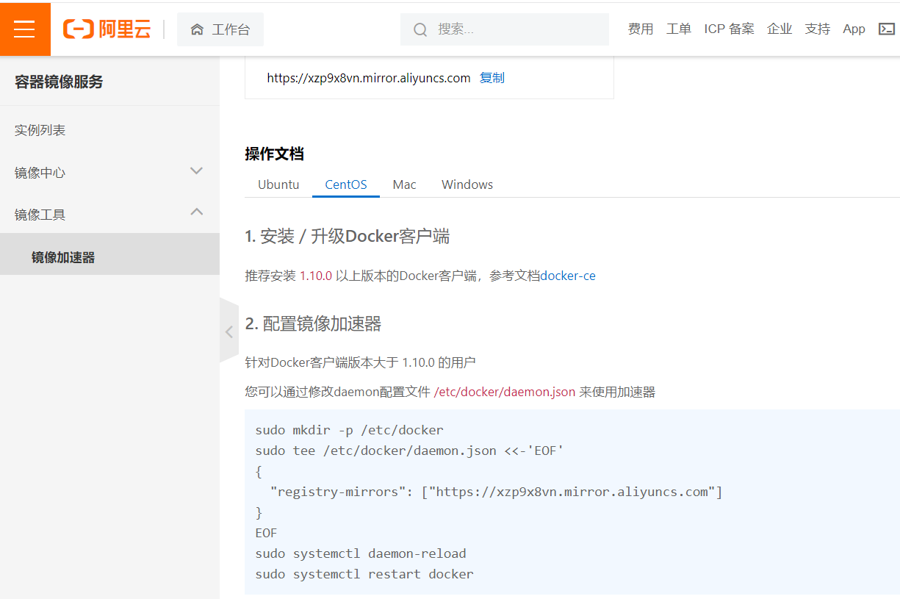

## 14.使用docker安装开发环境

```xml
docker 命令
1.MODE=standalone 是配置单机版，集群和单机的写代码都一样

安装nacos
1.docker run --name lxl-nacos -d -p 8848:8848 -e MODE=standalone nacos/nacos-server:2.0.2

安装mysql
1.docker run --name lxl-mysql -d -p 3306:3306 -e MYSQL_ROOT_PASSWORD=root mysql:5.6

安装tomcat8
1.docker search tomcat8 ---搜索tomcat镜像
2.inovatrend/tomcat8-java8 --这是版本号
3.完整命令 docker run --name lxl-tomcat -p8080:8080 -d inovatrend/tomcat8-java8

安装ssdb缓存服务器 --net 使用主机网络 相当于ssdb是191当中的一个应用，也就是 -p 8888:8888
docker run --name lxl-ssdb --net host -d -v /ssdb/var:/ssdb/var -v /config/ssdb.conf:/ssdb/ssdb.conf leobuskin/ssdb-docker

开放端口8888
firewall-cmd --zone=public --add-port=8888/tcp --permanent
刷新
firewall-cmd --reload
看一下
firewall-cmd --zone=public --list-ports

jhao104/ssdb-admin是ssdb的可视化工具 端口号是5000
docker run --name lxl-ssdbadmin -d --net host -e DB_CONFIG=192.168.175.130:8888 jhao104/ssdb-admin
开放端口
firewall-cmd --zone=public --add-port=5000/tcp --permanent


```

## 14.1安装nginx及配置

```xml
docker run --name lxl-nginx -d -p 80:8080 -v  /config/nginx.conf:/etc/nginx/nginx.conf nginx:1.18.0
```


## 15.配置远程部署骚操作

```
1.配置docker中的tomcat的配置文件
docker logs lxl-tomcat  --- 查看tomcat启动日志 目的是为了查看tomcat的位置
下图中/opt/tomcat中

2.进去容器内部
docker exec -it lxl-tomcat /bin/bash

3.cd /opt/tomcat   ---> ls

4.配置文件在conf下
  cd conf/
  
5.修改tomcat-users.xml的文件
  vi tomcat-users.xml
  
6.翻到最下面
 role标签只留前两个 下面的role也得删除对应的
 然后设置个好记的密码 保存并推出
 
7.exit 退出小房间到大房间

8.改了配置文件必须重启
  docker restart lxl-tomcat
```

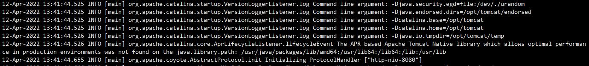

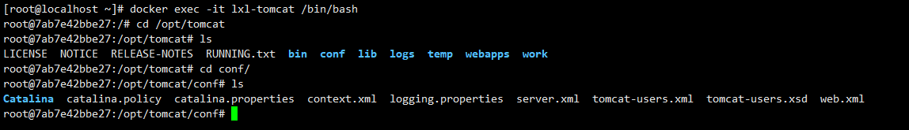

* 修改前

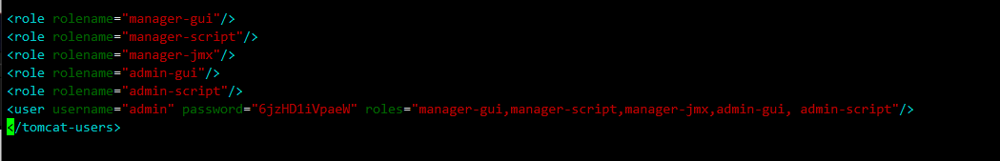

* 修改后

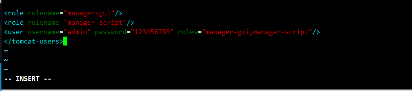

* 在pom文件中写以下代码

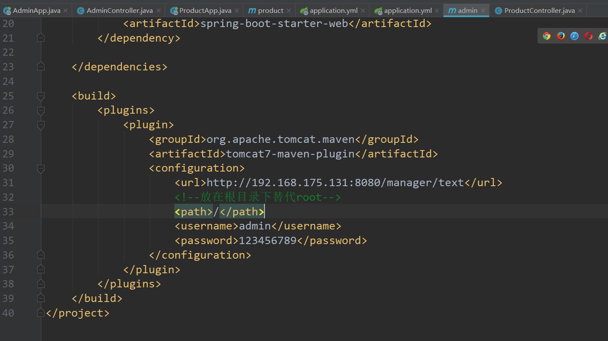

* 点这个就相当于直接部署

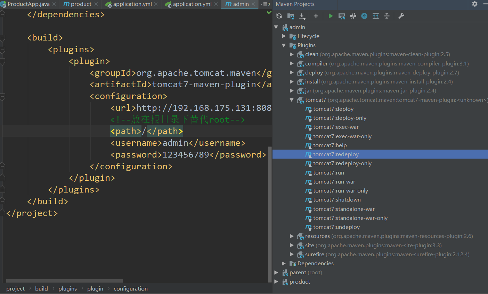

## 16.springboot集成redis

```xml
导包
<dependency>
    <groupId>org.springframework.boot</groupId>
    <artifactId>spring-boot-starter-data-redis</artifactId>
    <version>2.6.3</version>
</dependency>

<dependency>
    <groupId>org.springframework.boot</groupId>
    <artifactId>spring-boot-starter-cache</artifactId>
</dependency>

@EnableCaching 配置注解
```

## 17.vuex持久化

```xml
npm install vuex-persistedstate --save

在store中
import createPersistedState from "vuex-persistedstate"; 
```


# n.docker安装rabbitmq

* 安装rabbitmq

```xml
docker run --name lxl-rabbitmq -d -p 5672:5672 -p 15672:15672 -e RABBITMQ_DEFAULT_USER=admin -e RABBITMQ_DEFAULT_PASS=123456789 rabbitmq:3-management
```

* 导包

```xml
<!-- https://mvnrepository.com/artifact/org.springframework.boot/spring-boot-starter-amqp -->
<dependency>
    <groupId>org.springframework.boot</groupId>
    <artifactId>spring-boot-starter-amqp</artifactId>
    <version>2.6.3</version>
</dependency>
```

```xml
minio

docker run --name lxl-minio -d -p 9000:9000 -p 9001:9001 -v /mnt/data:/data -e MINIO_ROOT_USER=admin -e MINIO_ROOT_PASSWORD=123456789 quay.io/minio/minio server /data --console-address ":9001"
```

